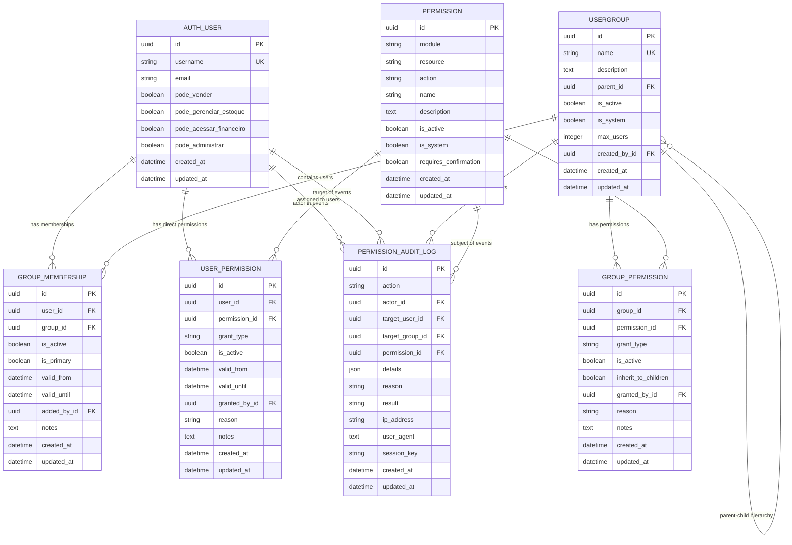

# Database Schema Documentation: User Permissions System

**System**: AtalaiasTintas - Hierarchical Permission System  
**Version**: 1.0  
**Created**: 2026-04-18  
**Migration**: 0004_add_hierarchical_permission_system  

---

## Entity Relationship Diagram (ERD)

---

## Table Details and Constraints

### 1. AUTH_USER (Extended Django User)
**Purpose**: Core user entity with extended permission system integration  
**Key Relationships**: 1:N with all permission entities  

#### Indexes:
- `PRIMARY KEY`: id (uuid)
- `UNIQUE`: username
- `INDEX`: email, is_active
- `COMPOSITE`: (is_active, username)

#### Constraints:
- `username`: Required, 150 chars max
- Legacy permission booleans preserved for backward compatibility
- Custom methods added for new permission system integration

---

### 2. USERGROUP
**Purpose**: Hierarchical groups for role-based permission management  
**Key Features**: Self-referencing hierarchy, soft delete, system groups  

#### Indexes:
- `PRIMARY KEY`: id (uuid)  
- `UNIQUE`: name
- `FOREIGN KEY`: parent_id → usergroup.id
- `FOREIGN KEY`: created_by_id → auth_user.id
- `INDEX`: (is_active, name)
- `INDEX`: parent_id (hierarchical queries)

#### Constraints:
- `name`: Required, unique, 80 chars max
- `is_system`: System groups cannot be deleted
- `max_users`: Optional limit on group membership
- Hierarchical validation prevents circular references

---

### 3. PERMISSION  
**Purpose**: Granular permissions with structured naming convention  
**Format**: `{module}.{resource}.{action}` (e.g., `tintometry.formula.create`)  

#### Indexes:
- `PRIMARY KEY`: id (uuid)
- `UNIQUE COMPOSITE`: (module, resource, action)
- `INDEX`: module (module-level queries)
- `INDEX`: (is_active, module)

#### Constraints:
- `module`: Required, 50 chars max (tintometry, sales, inventory, etc.)
- `resource`: Required, 50 chars max (formula, batch, order, etc.)  
- `action`: Required, 50 chars max (view, create, edit, delete, etc.)
- `is_system`: System permissions cannot be deleted
- Business rule: Unique permission codes prevent duplicates

---

### 4. GROUP_MEMBERSHIP
**Purpose**: Many-to-many relationship between users and groups with metadata  
**Key Features**: Temporal validity, audit trail, primary group designation  

#### Indexes:
- `PRIMARY KEY`: id (uuid)
- `UNIQUE COMPOSITE`: (user_id, group_id)
- `FOREIGN KEY`: user_id → auth_user.id
- `FOREIGN KEY`: group_id → usergroup.id  
- `FOREIGN KEY`: added_by_id → auth_user.id
- `INDEX`: (is_active, user_id)
- `INDEX`: (is_active, group_id)

#### Constraints:
- Prevents duplicate user-group associations
- Temporal validity: `valid_from` ≤ `valid_until`
- Only one primary group per user (business logic)

---

### 5. USER_PERMISSION
**Purpose**: Direct user permissions with temporal support and approval workflow  
**Key Features**: Grant/deny permissions, temporal validity, audit trail  

#### Indexes:
- `PRIMARY KEY`: id (uuid)
- `UNIQUE COMPOSITE`: (user_id, permission_id)
- `FOREIGN KEY`: user_id → auth_user.id
- `FOREIGN KEY`: permission_id → permission.id
- `FOREIGN KEY`: granted_by_id → auth_user.id
- `INDEX`: (is_active, user_id)
- `INDEX`: (is_active, permission_id)

#### Constraints:
- `grant_type`: ENUM('allow', 'deny') - explicit permission control
- Temporal validity validation
- Required reason for permission grants
- Prevents duplicate user-permission assignments

---

### 6. GROUP_PERMISSION
**Purpose**: Group-based permissions with hierarchical inheritance  
**Key Features**: Inherit to children, grant/deny, group-wide permissions  

#### Indexes:
- `PRIMARY KEY`: id (uuid)
- `UNIQUE COMPOSITE`: (group_id, permission_id)
- `FOREIGN KEY`: group_id → usergroup.id
- `FOREIGN KEY`: permission_id → permission.id
- `FOREIGN KEY`: granted_by_id → auth_user.id
- `INDEX`: (is_active, group_id)
- `INDEX`: (is_active, permission_id, inherit_to_children)

#### Constraints:
- Hierarchical inheritance controlled by `inherit_to_children` flag
- Grant/deny semantics with explicit control
- Prevents duplicate group-permission assignments

---

### 7. PERMISSION_AUDIT_LOG
**Purpose**: Complete audit trail for all permission-related activities  
**Key Features**: Immutable log, rich context, security compliance  

#### Indexes:
- `PRIMARY KEY`: id (uuid)
- `INDEX`: (actor_id, created_at DESC)
- `INDEX`: (target_user_id, created_at DESC)  
- `INDEX`: (action, created_at DESC)
- `INDEX`: created_at (chronological queries)
- `FOREIGN KEY`: actor_id → auth_user.id
- `FOREIGN KEY`: target_user_id → auth_user.id
- `FOREIGN KEY`: target_group_id → usergroup.id
- `FOREIGN KEY`: permission_id → permission.id

#### Constraints:
- `action`: Predefined action types for consistency
- `result`: ENUM('success', 'failure', 'partial')
- `details`: JSON field for flexible context storage
- Immutable records (no updates, only inserts)
- Required actor for accountability

---

## Permission Resolution Algorithm

### Hierarchy Resolution Order:
1. **Direct User Permissions** (highest priority)
   - Check `user_permission` table for explicit grants/denies
   - Temporal validity verification
   
2. **Group Permissions** (inherited)
   - Check user's active group memberships
   - Resolve permissions for each group
   
3. **Hierarchical Inheritance** (lowest priority)
   - Traverse parent groups recursively
   - Apply permissions marked with `inherit_to_children=True`

### Performance Optimizations:
- **Indexes**: Composite indexes for common query patterns
- **Caching Strategy**: Redis cache for frequently accessed permissions
- **Query Optimization**: Selective loading with proper JOINs
- **Batch Operations**: Bulk permission checks for UI rendering

---

## Data Integrity Guarantees

### Referential Integrity:
- All foreign key constraints properly enforced
- Cascade deletes for dependent records
- Orphan prevention for critical relationships

### Business Logic Validation:
- Temporal permission validity (start ≤ end dates)
- Hierarchical group validation (no circular references)
- Unique permission codes (module.resource.action)
- Primary group uniqueness per user

### Audit Trail Completeness:
- All permission changes logged with full context
- Immutable audit records with actor identification
- Rich metadata (IP, user agent, session) for security analysis

---

## Migration Rollback Procedures

### Tested Rollback Strategy:
1. **Backup current data** before rollback
2. **Execute rollback**: `python manage.py migrate core 0003`
3. **Verify rollback success**: Check table removal and constraint cleanup
4. **Re-apply if needed**: `python manage.py migrate core`
5. **Validate data integrity**: Run seed commands and validation scripts

### Rollback Safety:
- ✅ **Tested**: Rollback from 0004 to 0003 completed successfully
- ✅ **Validated**: Re-application maintains data integrity  
- ✅ **Preserved**: Legacy user permission fields remain intact
- ✅ **Consistent**: Foreign key constraints properly managed

---

## Security Considerations

### Access Control:
- UUID primary keys prevent enumeration attacks
- Temporal permissions support time-based access control
- Grant/deny semantics provide explicit security policies
- Audit trail enables compliance and forensic analysis

### Data Protection:
- Sensitive permission data properly indexed for performance
- Audit logs immutable for integrity assurance
- Foreign key constraints prevent orphaned security records
- Business logic validation prevents privilege escalation

---

## Compliance Features

### Audit Requirements:
- **WHO**: Actor identification in all permission changes
- **WHAT**: Complete action details with context
- **WHEN**: Timestamp precision for chronological analysis  
- **WHERE**: IP address and session tracking
- **WHY**: Reason codes for permission grants/revocations

### Data Retention:
- Audit logs retained indefinitely for compliance
- Temporal permissions support compliance deadlines
- Group hierarchy supports organizational reporting
- Permission inheritance enables delegation tracking