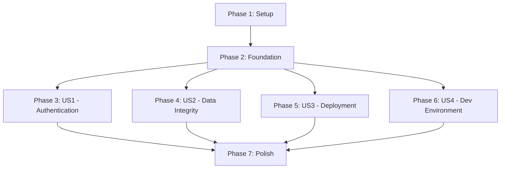

# Tasks: Sistema Core de Infraestrutura

**Input**: Design documents from `/specs/2-core-infrastructure/`
**Prerequisites**: plan.md ✅, spec.md ✅, research.md ✅, data-model.md ✅, contracts/api-spec.yaml ✅

**Tests**: Tests are NOT explicitly requested in specification - focusing on implementation tasks only

**Organization**: Tasks are grouped by user story to enable independent implementation and testing of each story.

**⚠️ IMPORTANT**: After generating tasks.md, ALWAYS run `/speckit.analyze` to validate consistency between spec, plan, and tasks before implementation begins.

## Format: `[ID] [P?] [Story] Description`

- **[P]**: Can run in parallel (different files, no dependencies)
- **[Story]**: Which user story this task belongs to (e.g., US1, US2, US3, US4)
- Include exact file paths in descriptions

## Path Conventions

Based on plan.md structure: `backend/` for Django application, `deployment/` for infrastructure, `tests/` for testing

---

## Phase 1: Setup (Shared Infrastructure)

**Purpose**: Project initialization and basic structure

- [x] T001 Create Django project structure in backend/tintas_system/ per implementation plan
- [x] T002 Initialize Python environment with Django 4.2+, DRF 3.14+, PostgreSQL 15+, Redis 7+ dependencies in requirements/base.txt
- [x] T003 [P] Configure development settings in backend/tintas_system/settings/development.py
- [x] T004 [P] Configure testing settings in backend/tintas_system/settings/testing.py
- [x] T005 [P] Configure production settings in backend/tintas_system/settings/production.py
- [x] T006 [P] Create base settings configuration in backend/tintas_system/settings/base.py
- [x] T007 [P] Setup Docker development environment in deployment/docker/docker-compose.yml
- [x] T008 [P] Create Dockerfile for web application in deployment/docker/Dockerfile.web
- [x] T009 [P] Create Dockerfile for Celery worker in deployment/docker/Dockerfile.worker

---

## Phase 2: Foundational (Blocking Prerequisites)

**Purpose**: Core infrastructure that MUST be complete before ANY user story can be implemented

**⚠️ CRITICAL**: No user story work can begin until this phase is complete

- [x] T010 Setup PostgreSQL database configuration and connection in backend/tintas_system/settings/base.py
- [x] T011 Setup Redis cache and session configuration in backend/tintas_system/settings/base.py
- [x] T012 [P] Create core Django app structure in backend/apps/core/
- [x] T013 [P] Create monitoring Django app structure in backend/apps/monitoring/
- [x] T014 Configure URL routing in backend/tintas_system/urls.py
- [x] T015 Setup Django REST Framework configuration in backend/tintas_system/settings/base.py
- [x] T016 [P] Configure CORS and security middleware in backend/tintas_system/settings/base.py
- [x] T017 [P] Setup Celery configuration in backend/tintas_system/celery.py
- [x] T018 Create initial database migrations setup
- [x] T019 [P] Configure logging system in backend/tintas_system/settings/base.py

**Checkpoint**: Foundation ready - user story implementation can now begin in parallel

---

## Phase 3: User Story 1 - Acessar Sistema com Segurança (Priority: P1) 🎯 MVP

**Goal**: Funcionários podem fazer login seguro com credenciais locais e receber permissões baseadas em funções de negócio

**Independent Test**: Criar usuário, fazer login via API, verificar que acesso é concedido com permissões corretas por role

### Implementation for User Story 1

- [ ] T020 [P] [US1] Create custom User model extending AbstractUser in backend/apps/core/models.py
- [ ] T021 [P] [US1] Create UserProfile model for extended user information in backend/apps/core/models.py  
- [ ] T022 [P] [US1] Create UserSession model for session tracking in backend/apps/core/models.py
- [ ] T023 [P] [US1] Create AuditLog model for user action logging in backend/apps/core/models.py
- [ ] T024 [US1] Create and run initial migrations for core models (depends on T020-T023)
- [ ] T025 [P] [US1] Implement role-based permissions system in backend/apps/core/permissions.py
- [ ] T026 [US1] Create authentication views (login, logout, me) in backend/apps/core/views.py  
- [ ] T027 [P] [US1] Create authentication middleware for session management in backend/apps/core/middleware.py
- [ ] T028 [P] [US1] Create audit logging middleware in backend/apps/core/middleware.py
- [ ] T029 [US1] Configure authentication URLs in backend/apps/core/urls.py
- [ ] T030 [US1] Implement user management serializers in backend/apps/core/serializers.py
- [ ] T031 [US1] Create Django admin configuration for user management in backend/apps/core/admin.py
- [ ] T032 [US1] Add user creation and management views in backend/apps/core/views.py
- [ ] T033 [US1] Implement password change functionality in backend/apps/core/views.py

**Checkpoint**: At this point, User Story 1 should be fully functional - users can authenticate, sessions are managed, and audit logs are created

---

## Phase 4: User Story 2 - Trabalhar sem Perda de Dados (Priority: P1)

**Goal**: Sistema preserva integridade de dados com backup automático, monitoramento e recuperação confiável

**Independent Test**: Simular falhas (reinicialização, queda de energia) e verificar que dados são recuperados corretamente após recuperação

### Implementation for User Story 2

- [ ] T034 [P] [US2] Create SystemHealth model for health metrics in backend/apps/monitoring/models.py
- [ ] T035 [P] [US2] Create AlertNotification model for alert tracking in backend/apps/monitoring/models.py
- [ ] T036 [P] [US2] Create Configuration model for system parameters in backend/apps/core/models.py
- [ ] T037 [P] [US2] Create BackupRecord model for backup audit trail in backend/apps/core/models.py
- [ ] T038 [US2] Create and run migrations for monitoring and configuration models (depends on T034-T037)
- [ ] T039 [P] [US2] Implement health check services in backend/apps/monitoring/services.py
- [ ] T040 [P] [US2] Create Celery tasks for automated health monitoring in backend/apps/monitoring/tasks.py
- [ ] T041 [P] [US2] Implement email/SMS alert services in backend/apps/monitoring/services.py
- [ ] T042 [US2] Create health check API endpoints in backend/apps/monitoring/views.py
- [ ] T043 [P] [US2] Create backup management command in backend/apps/core/management/commands/create_backup.py
- [ ] T044 [P] [US2] Create health check management command in backend/apps/core/management/commands/health_check.py
- [ ] T045 [P] [US2] Implement configuration management views in backend/apps/core/views.py
- [ ] T046 [US2] Setup Celery beat scheduler for automated tasks in backend/tintas_system/settings/base.py
- [ ] T047 [P] [US2] Create backup automation script in backend/scripts/backup.sh
- [ ] T048 [P] [US2] Create system health monitoring script in backend/scripts/health_check.sh
- [ ] T049 [US2] Configure monitoring URLs in backend/apps/monitoring/urls.py

**Checkpoint**: At this point, User Story 2 should be fully functional - system monitors itself, creates backups, and sends alerts when needed

---

## Phase 5: User Story 3 - Deploy Confiável de Atualizações (Priority: P2)

**Goal**: Administradores podem fazer deploy de atualizações sem interrupção usando blue-green strategy com rollback instantâneo

**Independent Test**: Fazer deploy de uma alteração e verificar que sistema continua funcionando normalmente, testar rollback em menos de 5 minutos

### Implementation for User Story 3

- [ ] T050 [P] [US3] Create Nginx configuration template in backend/config/nginx.conf
- [ ] T051 [P] [US3] Create Gunicorn configuration in backend/config/gunicorn.conf.py  
- [ ] T052 [P] [US3] Create Supervisor configuration for process management in backend/config/supervisor.conf
- [ ] T053 [P] [US3] Create blue-green deployment script in backend/scripts/deploy.sh
- [ ] T054 [P] [US3] Create Ansible deployment playbook in deployment/ansible/playbooks/deploy.yml
- [ ] T055 [P] [US3] Create Ansible backup playbook in deployment/ansible/playbooks/backup.yml
- [ ] T056 [P] [US3] Create Ansible monitoring playbook in deployment/ansible/playbooks/monitoring.yml
- [ ] T057 [P] [US3] Configure Ansible inventory for development in deployment/ansible/inventory/development
- [ ] T058 [P] [US3] Configure Ansible inventory for staging in deployment/ansible/inventory/staging
- [ ] T059 [P] [US3] Configure Ansible inventory for production in deployment/ansible/inventory/production
- [ ] T060 [US3] Create deployment status API endpoints for blue-green coordination in backend/apps/core/views.py
- [ ] T061 [P] [US3] Create Terraform infrastructure configuration in deployment/terraform/main.tf
- [ ] T062 [P] [US3] Create Terraform variables configuration in deployment/terraform/variables.tf
- [ ] T063 [P] [US3] Create Terraform outputs configuration in deployment/terraform/outputs.tf

**Checkpoint**: At this point, User Story 3 should be fully functional - deployments happen without downtime and rollback works reliably

---

## Phase 6: User Story 4 - Ambiente de Desenvolvimento Isolado (Priority: P3)

**Goal**: Desenvolvedores podem configurar ambiente local idêntico à produção em menos de 10 minutos

**Independent Test**: Código clonado + setup executado = ambiente funcional em menos de 10 minutos

### Implementation for User Story 4

- [ ] T064 [P] [US4] Create comprehensive development Docker Compose in deployment/docker/docker-compose.yml
- [ ] T065 [P] [US4] Create development environment setup script in scripts/setup_dev.sh
- [ ] T066 [P] [US4] Create database seeding script with test data in backend/apps/core/management/commands/seed_data.py
- [ ] T067 [P] [US4] Update requirements with development dependencies in requirements/development.txt
- [ ] T068 [P] [US4] Create testing configuration with pytest setup in requirements/testing.txt
- [ ] T069 [P] [US4] Create development fixtures and test data in tests/fixtures/
- [ ] T070 [P] [US4] Create integration test examples in tests/integration/test_authentication_flow.py
- [ ] T071 [P] [US4] Create integration test examples in tests/integration/test_backup_recovery.py
- [ ] T072 [P] [US4] Create integration test examples in tests/integration/test_monitoring_alerts.py
- [ ] T073 [P] [US4] Create unit test examples in tests/unit/test_models.py
- [ ] T074 [P] [US4] Create unit test examples in tests/unit/test_permissions.py
- [ ] T075 [P] [US4] Create unit test examples in tests/unit/test_services.py
- [ ] T076 [US4] Update quickstart.md with final setup instructions in specs/2-core-infrastructure/quickstart.md

**Checkpoint**: All user stories should now be independently functional - complete infrastructure ready for business feature development

---

## Phase 7: Polish & Cross-Cutting Concerns

**Purpose**: Final integration, documentation, and production readiness

- [ ] T077 [P] Create comprehensive API documentation from OpenAPI spec
- [ ] T078 [P] Setup production environment variables template in .env.example
- [ ] T079 [P] Configure production-ready logging and error monitoring
- [ ] T080 [P] Create monitoring dashboards and health check endpoints
- [ ] T081 [P] Setup automated security scanning and dependency updates
- [ ] T082 Final integration testing of all user stories together
- [ ] T083 Performance optimization and load testing setup
- [ ] T084 Production deployment guide and operations documentation

---

## Dependencies

**Critical Path**: Setup → Foundation → Authentication (US1) → Polish
**Parallel Opportunities**: US1, US2, US3, US4 can be developed simultaneously after Foundation is complete

---

## Parallel Execution Examples

### After Foundation (Phase 2) Complete:

**Team A**: Focus on US1 (Authentication) - Tasks T020-T033
**Team B**: Focus on US2 (Data Integrity) - Tasks T034-T049  
**Team C**: Focus on US3 (Deployment) - Tasks T050-T063
**Team D**: Focus on US4 (Dev Environment) - Tasks T064-T076

Each team can work independently on their user story since foundation provides the shared infrastructure.

---

## Implementation Strategy

### MVP Scope (Minimum Viable Product)
- **Phase 1**: Setup ✅
- **Phase 2**: Foundation ✅  
- **Phase 3**: US1 - Authentication ✅
- **Phase 4**: US2 - Data Integrity ✅

**Rationale**: MVP includes P1 user stories (Authentication + Data Integrity) which provide core infrastructure needed for any paint store operations.

### Full Feature Set
- Add Phase 5 (Deployment) and Phase 6 (Dev Environment) for complete infrastructure
- Includes all P2 and P3 user stories for production-ready deployment

### Success Metrics
- **US1**: Login API responds in <10 seconds, role-based permissions work correctly
- **US2**: 99.5% uptime during business hours, backups complete successfully, alerts fire when appropriate  
- **US3**: Deploy completed without service interruption, rollback works in <5 minutes
- **US4**: New developer setup completes in <10 minutes with working environment

---

## Task Summary

**Total Tasks**: 84
- **Setup**: 9 tasks
- **Foundation**: 10 tasks  
- **US1 (Authentication)**: 14 tasks
- **US2 (Data Integrity)**: 16 tasks
- **US3 (Deployment)**: 14 tasks  
- **US4 (Dev Environment)**: 13 tasks
- **Polish**: 8 tasks

**Parallel Opportunities**: 47 tasks marked with [P] can run in parallel
**Independent Stories**: Each user story can be implemented and tested independently

**Format Validation**: ✅ All tasks follow required checklist format with IDs, [P] markers, [Story] labels, and exact file paths