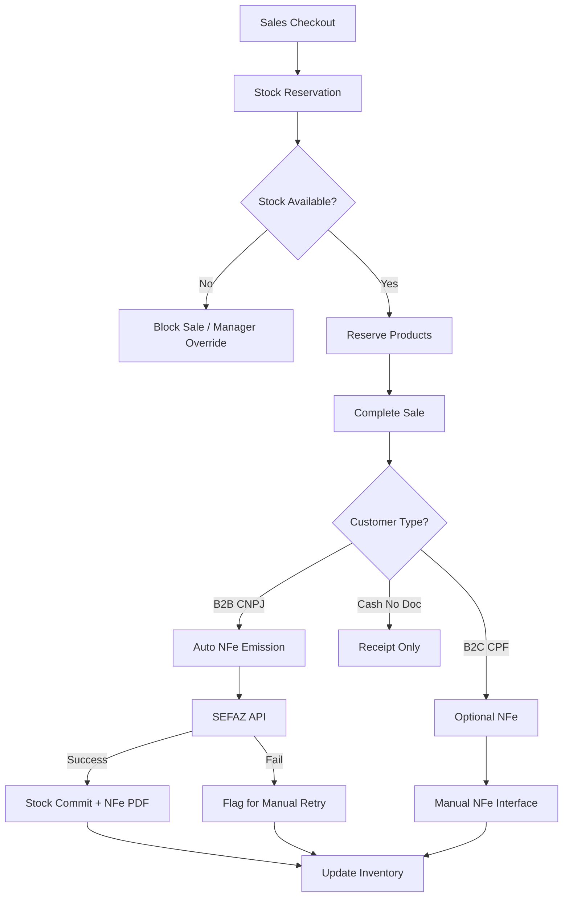

# Implementation Plan: Sistema Integrado de Controle de Estoque e NFe

**Branch**: `4-inventory-fiscal-integration` | **Date**: 2026-04-12 | **Spec**: [spec.md](spec.md)
**Input**: Feature specification from `/specs/4-inventory-fiscal-integration/spec.md`

## Summary

Implement automated inventory management with semi-automatic NFe emission for paint store operations. System provides multi-unit product control, reservation-based checkout, configurable inventory policies, and seamless SEFAZ integration with business rules for B2B vs B2C sales.

**Status**: 🏗️ **PLANNING COMPLETE** - Ready for `/speckit.checklist` phase

## Architectural Vision *(mandatory)*

1. **Inventory Engine**: Multi-unit conversion system with configurable base units and automatic stock consolidation
2. **Reservation System**: Temporary stock allocation during checkout with 30-minute expiration and automatic cleanup
3. **NFe Automation Router**: Business rule engine determining automatic vs manual NFe emission based on customer type
4. **Stock Transaction Manager**: Atomic operations ensuring data consistency across sales, inventory, and fiscal operations
5. **SEFAZ Integration Hub**: Robust API client with retry logic, fallback mechanisms, and status tracking
6. **Event-Driven Architecture**: Django signals and Celery tasks for decoupled, asynchronous processing

## Technical Context

**Language/Version**: Python 3.11+
**Primary Dependencies**: Django 4.2+, DRF 3.14+, Celery 5.3+, Redis 7+, python-decouple, requests
**Storage**: PostgreSQL 15 (primary), Redis 7 (reservations/cache), AWS S3 (NFe XMLs/PDFs)
**Testing**: pytest, pytest-django, factory-boy, VCR.py (SEFAZ mocking)
**Target Platform**: Existing Django project extending apps: inventory, fiscal, sales, core
**Performance Goals**: Stock queries < 1s, NFe emission < 30s, reservation cleanup < 5min
**Constraints**: ACID transactions for stock operations, SEFAZ rate limits (1 req/2s), fiscal compliance

## System Architecture

### Core Integration Flow



### Database Architecture

**Extended Models** (building on existing `inventory`, `fiscal`, `sales` apps):

```python
# apps/inventory/models.py (EXTENDED)

class UnidadeMedida(TimeStampedModel):
    """Measurement units for multi-unit support"""
    codigo = models.CharField(max_length=10, unique=True)  # L, ML, LATA, GALON
    nome = models.CharField(max_length=50)  # Litro, Mililitro, Lata, Galão
    sigla = models.CharField(max_length=5)  # L, ml, lt, gl
    tipo = models.CharField(max_length=20, choices=[
        ('VOLUME', 'Volume'),
        ('PESO', 'Peso'), 
        ('UNIDADE', 'Unidade'),
        ('AREA', 'Área')
    ])
    
class ProdutoUnidade(TimeStampedModel):
    """Product-specific unit configurations with conversions"""
    produto = models.ForeignKey('Produto', on_delete=models.CASCADE)
    unidade = models.ForeignKey(UnidadeMedida, on_delete=models.CASCADE)
    unidade_base = models.BooleanField(default=False)  # One base unit per product
    fator_conversao = models.DecimalField(max_digits=10, decimal_places=6, default=1)
    preco_diferenciado = models.DecimalField(max_digits=10, decimal_places=2, null=True, blank=True)
    ativa = models.BooleanField(default=True)
    
    class Meta:
        unique_together = ['produto', 'unidade']

class EstoqueReserva(TimeStampedModel):
    """Temporary stock reservations during checkout"""
    id = models.UUIDField(primary_key=True, default=uuid.uuid4)
    produto = models.ForeignKey('ProdutoVariacao', on_delete=models.CASCADE)
    quantidade_reservada = models.DecimalField(max_digits=10, decimal_places=4)
    unidade = models.ForeignKey(UnidadeMedida, on_delete=models.CASCADE)
    sessao_checkout = models.CharField(max_length=100)  # Session or cart ID
    usuario = models.ForeignKey(User, on_delete=models.CASCADE, null=True)
    expira_em = models.DateTimeField()  # 30 minutes from creation
    venda = models.ForeignKey('sales.Venda', on_delete=models.CASCADE, null=True, blank=True)
    
    # Status tracking
    STATUS_CHOICES = [
        ('ATIVA', 'Ativa'),
        ('CONFIRMADA', 'Confirmada'),
        ('EXPIRADA', 'Expirada'),
        ('CANCELADA', 'Cancelada')
    ]
    status = models.CharField(max_length=15, choices=STATUS_CHOICES, default='ATIVA')

class MovimentacaoEstoque(TimeStampedModel):
    """Complete stock movement history with multi-unit support"""
    id = models.UUIDField(primary_key=True, default=uuid.uuid4)
    produto = models.ForeignKey('ProdutoVariacao', on_delete=models.CASCADE)
    
    TIPOS_MOVIMENTACAO = [
        ('ENTRADA_COMPRA', 'Entrada por Compra'),
        ('ENTRADA_AJUSTE', 'Entrada por Ajuste'),  
        ('ENTRADA_TRANSFERENCIA', 'Entrada por Transferência'),
        ('ENTRADA_DEVOLUCAO', 'Entrada por Devolução'),
        ('SAIDA_VENDA', 'Saída por Venda'),
        ('SAIDA_AJUSTE', 'Saída por Ajuste'),
        ('SAIDA_TRANSFERENCIA', 'Saída por Transferência'),
        ('SAIDA_PERDA', 'Saída por Perda'),
        ('RESERVA', 'Reserva Temporária'),
        ('LIBERACAO_RESERVA', 'Liberação de Reserva'),
    ]
    tipo_movimentacao = models.CharField(max_length=30, choices=TIPOS_MOVIMENTACAO)
    
    # Quantities in both original and base units
    quantidade_original = models.DecimalField(max_digits=10, decimal_places=4)
    unidade_original = models.ForeignKey(UnidadeMedida, on_delete=models.PROTECT, related_name='movimentacoes_origem')
    quantidade_base = models.DecimalField(max_digits=10, decimal_places=4)  # Converted to base unit
    unidade_base = models.ForeignKey(UnidadeMedida, on_delete=models.PROTECT, related_name='movimentacoes_base')
    
    # Stock levels before/after
    estoque_antes = models.DecimalField(max_digits=10, decimal_places=4, null=True)
    estoque_depois = models.DecimalField(max_digits=10, decimal_places=4, null=True)
    
    # References
    venda = models.ForeignKey('sales.Venda', on_delete=models.CASCADE, null=True, blank=True)
    nfe = models.ForeignKey('fiscal.NotaFiscalEletronica', on_delete=models.SET_NULL, null=True, blank=True)
    reserva = models.ForeignKey(EstoqueReserva, on_delete=models.SET_NULL, null=True, blank=True)
    usuario = models.ForeignKey(User, on_delete=models.PROTECT)
    
    # Documentation
    observacoes = models.TextField(blank=True)
    documento_referencia = models.CharField(max_length=100, blank=True)  # NF fornecedor, etc.
```

**Enhanced NFe Models** (extending `apps/fiscal/models.py`):

```python
# apps/fiscal/models.py (EXTENDED)

class NotaFiscalEletronica(TimeStampedModel):
    """Enhanced NFe model with automation support"""
    id = models.UUIDField(primary_key=True, default=uuid.uuid4)
    
    # Basic NFe data
    numero = models.IntegerField(null=True, blank=True)  # SEFAZ assigned
    serie = models.IntegerField(default=1)
    chave_acesso = models.CharField(max_length=44, null=True, blank=True, unique=True)
    
    # Business references
    venda = models.OneToOneField('sales.Venda', on_delete=models.CASCADE, related_name='nfe')
    empresa = models.ForeignKey('companies.Empresa', on_delete=models.CASCADE)
    loja = models.ForeignKey('companies.Loja', on_delete=models.CASCADE)
    cliente = models.ForeignKey('sales.Cliente', on_delete=models.CASCADE)
    
    # Emission control
    TIPOS_EMISSAO = [
        ('AUTOMATICA_B2B', 'Automática B2B'),
        ('MANUAL_B2C', 'Manual B2C'),
        ('MANUAL_CORRECAO', 'Manual Correção'),
    ]
    tipo_emissao = models.CharField(max_length=20, choices=TIPOS_EMISSAO)
    
    STATUS_CHOICES = [
        ('RASCUNHO', 'Rascunho'),
        ('VALIDANDO', 'Validando Dados'),
        ('ENVIANDO', 'Enviando para SEFAZ'),
        ('AUTORIZADA', 'Autorizada'),
        ('REJEITADA', 'Rejeitada'),
        ('CANCELADA', 'Cancelada'),
        ('ERRO_TECNICO', 'Erro Técnico'),
        ('AGUARDANDO_RETRY', 'Aguardando Retry Manual'),
    ]
    status = models.CharField(max_length=20, choices=STATUS_CHOICES, default='RASCUNHO')
    
    # SEFAZ integration
    protocolo_autorizacao = models.CharField(max_length=20, null=True, blank=True)
    data_autorizacao = models.DateTimeField(null=True, blank=True)
    xml_enviado = models.TextField(null=True, blank=True)
    xml_retorno = models.TextField(null=True, blank=True)
    pdf_nfe = models.FileField(upload_to='nfe/pdfs/', null=True, blank=True)
    
    # Error handling
    tentativas_envio = models.IntegerField(default=0)
    ultima_tentativa = models.DateTimeField(null=True, blank=True)
    erro_ultimo = models.TextField(null=True, blank=True)
    
    # Retry control for failed automatic emissions
    requer_retry_manual = models.BooleanField(default=False)
    retry_agendado_para = models.DateTimeField(null=True, blank=True)

class ItemNotaFiscal(TimeStampedModel):
    """NFe line items with multi-unit support"""
    nfe = models.ForeignKey(NotaFiscalEletronica, on_delete=models.CASCADE, related_name='itens')
    produto = models.ForeignKey('inventory.ProdutoVariacao', on_delete=models.CASCADE)
    
    # Product identification
    codigo_produto = models.CharField(max_length=60)  # Internal code
    descricao = models.CharField(max_length=120)
    ncm = models.CharField(max_length=8)  # Fiscal classification
    
    # Quantities and units
    quantidade = models.DecimalField(max_digits=10, decimal_places=4)
    unidade_comercial = models.CharField(max_length=6)  # Unit sold to customer
    unidade_tributaria = models.CharField(max_length=6)  # Unit for tax calculation
    
    # Pricing
    valor_unitario = models.DecimalField(max_digits=12, decimal_places=4)
    valor_total = models.DecimalField(max_digits=12, decimal_places=2)
    
    # Tax details (simplified for paint store)
    aliquota_icms = models.DecimalField(max_digits=5, decimal_places=2, default=0)
    valor_icms = models.DecimalField(max_digits=12, decimal_places=2, default=0)
```

**Sales Integration** (extending `apps/sales/models.py`):

```python
# apps/sales/models.py (EXTENDED)

class Venda(TimeStampedModel):  # EXISTING MODEL - ADD FIELDS
    # ... existing fields ...
    
    # NFe automation control
    requer_nfe_automatica = models.BooleanField(default=False)  # Set based on customer type
    nfe_processada = models.BooleanField(default=False)
    nfe_falhou = models.BooleanField(default=False)
    
    # Inventory integration
    estoque_baixado = models.BooleanField(default=False)
    reservas_ativas = models.ManyToManyField('inventory.EstoqueReserva', blank=True)

class ItemVenda(TimeStampedModel):  # EXISTING MODEL - ADD FIELDS
    # ... existing fields ...
    
    # Multi-unit support
    unidade_vendida = models.ForeignKey('inventory.UnidadeMedida', on_delete=models.PROTECT)
    quantidade_unidade_base = models.DecimalField(max_digits=10, decimal_places=4)  # Converted quantity
    fator_conversao_usado = models.DecimalField(max_digits=10, decimal_places=6, default=1)
```

### API Architecture

**New REST Endpoints** (extending existing DRF structure):

```python
# apps/inventory/apis.py (NEW)

class EstoqueReservaViewSet(viewsets.ModelViewSet):
    """Manage stock reservations during checkout"""
    # POST /api/inventory/reservas/ - Create reservation
    # PUT /api/inventory/reservas/{id}/extend/ - Extend expiration
    # DELETE /api/inventory/reservas/{id}/ - Cancel reservation
    # POST /api/inventory/reservas/bulk-create/ - Reserve multiple products

class ConversaoUnidadeViewSet(viewsets.ReadOnlyModelViewSet):
    """Unit conversion calculator"""
    # GET /api/inventory/conversoes/{produto_id}/ - Available units for product
    # POST /api/inventory/conversoes/calcular/ - Convert between units

class EstoqueConsultaAPIView(APIView):
    """Real-time stock availability"""
    # GET /api/inventory/estoque/{produto_id}/ - Current stock by units
    # POST /api/inventory/estoque/verificar-disponibilidade/ - Bulk availability check

# apps/fiscal/apis.py (NEW)

class NFEAutomacaoViewSet(viewsets.ModelViewSet):
    """NFe automation management"""
    # POST /api/fiscal/nfe/processar-venda/{venda_id}/ - Trigger NFe for sale
    # POST /api/fiscal/nfe/{id}/retry/ - Manual retry failed NFe
    # GET /api/fiscal/nfe/pendentes/ - List NFe awaiting manual action
    
class SefazIntegracaoAPIView(APIView):
    """SEFAZ integration endpoints"""
    # POST /api/fiscal/sefaz/consultar-status/ - Check SEFAZ service status
    # POST /api/fiscal/sefaz/validar-xml/ - Validate NFe XML before sending
```

### Service Layer Architecture

**New Service Classes** (following Django service pattern):

```python
# apps/inventory/services.py (NEW)

class EstoqueService:
    """Core inventory management service"""
    
    @staticmethod
    def calcular_disponibilidade(produto_id: int, unidade_id: int) -> Decimal:
        """Calculate available stock in requested unit"""
        
    @staticmethod  
    def criar_reserva(produto_id: int, quantidade: Decimal, unidade_id: int, 
                     sessao_id: str, usuario_id: int) -> EstoqueReserva:
        """Create temporary stock reservation with validation"""
        
    @staticmethod
    def confirmar_reservas(venda_id: int) -> bool:
        """Convert reservations to permanent stock movements"""
        
    @staticmethod
    def processar_baixa_venda(venda: Venda) -> List[MovimentacaoEstoque]:
        """Process stock movements for completed sale with multi-unit conversion"""

class ConversaoService:
    """Multi-unit conversion management"""
    
    @staticmethod
    def converter_quantidade(produto_id: int, quantidade: Decimal, 
                           unidade_origem_id: int, unidade_destino_id: int) -> Decimal:
        """Convert quantity between units for same product"""
        
    @staticmethod
    def obter_unidade_base(produto_id: int) -> UnidadeMedida:
        """Get base unit for product stock consolidation"""

# apps/fiscal/services.py (NEW)

class NFEService:
    """NFe business logic and SEFAZ integration"""
    
    @staticmethod
    def deve_emitir_nfe_automatica(venda: Venda) -> bool:
        """Determine if NFe should be auto-generated based on customer type"""
        
    @staticmethod
    def processar_nfe_venda(venda_id: int, tipo_emissao: str = 'AUTO') -> NotaFiscalEletronica:
        """Main NFe processing workflow with error handling"""
        
    @staticmethod
    def gerar_xml_nfe(nfe: NotaFiscalEletronica) -> str:
        """Generate NFe XML following SEFAZ layout 4.00"""
        
    @staticmethod
    def enviar_sefaz(nfe: NotaFiscalEletronica) -> dict:
        """Send NFe to SEFAZ with retry logic and status tracking"""

class SefazClient:
    """SEFAZ API integration client"""
    
    def __init__(self, config: ConfiguracaoFiscal):
        self.config = config
        
    def autorizar_nfe(self, xml_nfe: str) -> dict:
        """Send NFe for authorization"""
        
    def consultar_situacao(self, chave_acesso: str) -> dict:
        """Check NFe status"""
        
    def cancelar_nfe(self, chave_acesso: str, motivo: str) -> dict:
        """Cancel authorized NFe"""
```

### Event-Driven Architecture

**Django Signals Integration** (apps/core/signals.py):

```python
from django.db.models.signals import post_save, pre_delete
from django.dispatch import receiver
from apps.sales.models import Venda
from apps.inventory.services import EstoqueService
from apps.fiscal.services import NFEService
from apps.fiscal.tasks import processar_nfe_async

@receiver(post_save, sender=Venda)
def processar_venda_finalizada(sender, instance, created, **kwargs):
    """Handle completed sale workflow"""
    if instance.status == 'FINALIZADA' and not instance.estoque_baixado:
        # Process stock movements
        EstoqueService.confirmar_reservas(instance.id)
        instance.estoque_baixado = True
        instance.save()
        
        # Queue NFe processing if required
        if NFEService.deve_emitir_nfe_automatica(instance):
            processar_nfe_async.delay(instance.id)

@receiver(pre_delete, sender=Venda)
def limpar_reservas_venda_cancelada(sender, instance, **kwargs):
    """Clean up reservations when sale is cancelled"""
    EstoqueService.liberar_reservas_venda(instance.id)
```

**Celery Tasks** (apps/fiscal/tasks.py):

```python
from celery import shared_task
from django.utils import timezone
from apps.fiscal.services import NFEService
from apps.inventory.services import EstoqueService

@shared_task(bind=True, max_retries=3)
def processar_nfe_async(self, venda_id: int):
    """Async NFe processing with retry logic"""
    try:
        nfe = NFEService.processar_nfe_venda(venda_id, 'AUTOMATICA_B2B')
        return f"NFe {nfe.numero} processada com sucesso"
    except Exception as exc:
        if self.request.retries < self.max_retries:
            # Retry with exponential backoff
            raise self.retry(exc=exc, countdown=60 * (2 ** self.request.retries))
        else:
            # Mark for manual retry after max attempts
            NFEService.marcar_para_retry_manual(venda_id, str(exc))
            return f"NFe failed after {self.max_retries} attempts, marked for manual retry"

@shared_task
def limpar_reservas_expiradas():
    """Cleanup expired reservations - run every 5 minutes"""
    count = EstoqueService.limpar_reservas_expiradas()
    return f"Cleaned {count} expired reservations"

@shared_task  
def retry_nfe_falhadas():
    """Retry failed NFe emissions - run every hour"""
    nfes_pendentes = NFEService.obter_nfes_para_retry()
    results = []
    for nfe in nfes_pendentes:
        try:
            NFEService.reprocessar_nfe(nfe.id)
            results.append(f"NFe {nfe.id} reprocessada com sucesso")
        except Exception as e:
            results.append(f"NFe {nfe.id} ainda falhou: {str(e)}")
    return results
```

## Integration Points

### Existing Apps Integration

**Database Migrations Strategy**:
1. **Phase 1**: Add new models without breaking existing functionality
2. **Phase 2**: Add foreign keys and relationships to existing models  
3. **Phase 3**: Data migration for existing products/sales
4. **Phase 4**: Enable new features with feature flags

**API Backwards Compatibility**:
- Existing endpoints maintain current response format
- New fields added as optional with default values
- Versioned API endpoints for breaking changes (/api/v2/)

### External Integrations

**SEFAZ WebServices** (NF-e 4.00):
- **Authorization**: `/ws/NFeAutorizacao4.asmx` 
- **Status Query**: `/ws/NFeStatusServico4.asmx`
- **Cancellation**: `/ws/RecepcaoEvento4.asmx`
- **Retry Logic**: Exponential backoff (2s, 4s, 8s, 16s, manual)
- **Rate Limiting**: 1 request per 2 seconds per CNPJ
- **Timeout Handling**: 30s connection, 60s read timeout

**Redis Integration** (Session Storage):
- **Reservations**: `stock:reservation:{session_id}` (30 min TTL)
- **User Sessions**: `session:{session_id}` (8 hours TTL)  
- **SEFAZ Cache**: `sefaz:status` (5 min TTL)
- **Conversion Cache**: `conversion:{produto_id}:{from}:{to}` (24 hours TTL)

## File Organization

```
backend/
├── apps/
│   ├── inventory/  (EXTENDED)
│   │   ├── migrations/
│   │   │   ├── 0003_multi_unit_support.py
│   │   │   └── 0004_stock_reservations.py  
│   │   ├── models.py  (+ UnidadeMedida, ProdutoUnidade, EstoqueReserva, MovimentacaoEstoque)
│   │   ├── services.py  (NEW - EstoqueService, ConversaoService)
│   │   ├── apis.py  (NEW - reservation, conversion, stock query APIs)
│   │   ├── tasks.py  (NEW - cleanup tasks)
│   │   └── admin.py  (+ multi-unit admin interfaces)
│   │
│   ├── fiscal/  (EXTENDED)
│   │   ├── migrations/
│   │   │   ├── 0002_nfe_automation.py
│   │   │   └── 0003_sefaz_integration.py
│   │   ├── models.py  (+ NotaFiscalEletronica, ItemNotaFiscal enhancements)
│   │   ├── services.py  (NEW - NFEService, SefazClient)
│   │   ├── apis.py  (NEW - NFe automation APIs)
│   │   ├── tasks.py  (NEW - async NFe processing)
│   │   ├── xml_templates/  (NEW - NFe XML generation templates)
│   │   └── sefaz/  (NEW - SEFAZ integration modules)
│   │       ├── client.py
│   │       ├── validators.py
│   │       └── exceptions.py
│   │
│   ├── sales/  (EXTENDED) 
│   │   ├── migrations/
│   │   │   └── 0002_inventory_fiscal_integration.py
│   │   ├── models.py  (+ NFe automation fields)
│   │   ├── services.py  (updated for reservation integration)
│   │   └── apis.py  (updated checkout flow)
│   │
│   └── core/  (EXTENDED)
│       ├── signals.py  (NEW - event handling)
│       ├── exceptions.py  (+ inventory/fiscal exceptions)
│       └── permissions.py  (+ inventory override permissions)
│
├── static/js/
│   ├── inventory/
│   │   ├── multi-unit-calculator.js  (NEW)
│   │   └── stock-reservation.js  (NEW)
│   └── fiscal/
│       ├── nfe-automation.js  (NEW)
│       └── sefaz-status.js  (NEW)
│
├── templates/
│   ├── inventory/
│   │   ├── stock-availability.html  (NEW)
│   │   └── unit-conversion.html  (NEW)
│   └── fiscal/
│       ├── nfe-automation-dashboard.html  (NEW)
│       └── manual-retry-queue.html  (NEW)
│
└── requirements/
    └── fiscal.txt  (NEW - NFe specific dependencies)
```

## Dependencies & Libraries

**New Python Packages**:
```python
# Fiscal/NFe specific
lxml==4.9.3              # XML processing for NFe
signxml==3.2.0           # Digital signature for NFe
cryptography==41.0.7     # Certificate handling
suds-community==1.4.5    # SOAP client for SEFAZ (backup)
zeep==4.2.1              # Modern SOAP client
python-decouple==3.8     # Environment configuration

# Task processing
celery==5.3.4            # Async task processing
redis==5.0.1             # Message broker and cache
celery-beat==2.5.0       # Periodic task scheduling

# Additional utilities
pillow==10.1.0           # Image processing (existing, confirm version)
reportlab==4.0.7         # PDF generation for NFe
qrcode==7.4.2            # QR code for NFe
```

**Environment Variables** (extend existing `.env`):
```bash
# NFe Configuration
NFE_AMBIENTE=HOMOLOGACAO  # PRODUCAO | HOMOLOGACAO
NFE_TIMEOUT_CONNECTION=30
NFE_TIMEOUT_READ=60  
NFE_MAX_RETRIES=3
NFE_RETRY_DELAY=2

# SEFAZ URLs (per state - SP example)
SEFAZ_SP_AUTORIZACAO_URL=https://nfe.fazenda.sp.gov.br/ws/nfeautorizacao4.asmx
SEFAZ_SP_STATUS_URL=https://nfe.fazenda.sp.gov.br/ws/nfestatusservico4.asmx  
SEFAZ_SP_CONSULTA_URL=https://nfe.fazenda.sp.gov.br/ws/nfeconsultaprotocolo4.asmx

# Redis Configuration (extend existing)
REDIS_RESERVATION_TTL=1800  # 30 minutes
REDIS_CONVERSION_CACHE_TTL=86400  # 24 hours

# File Storage
NFE_STORAGE_PATH=storage/nfe/
NFE_PDF_STORAGE=storage/nfe/pdfs/
NFE_XML_STORAGE=storage/nfe/xmls/
```

## Testing Strategy

**Unit Tests** (pytest):
```python
# tests/inventory/test_services.py
class TestEstoqueService:
    def test_criar_reserva_produto_disponivel(self):
        # Test successful reservation creation
        
    def test_criar_reserva_estoque_insuficiente(self):
        # Test reservation failure when insufficient stock
        
    def test_conversao_entre_unidades(self):  
        # Test multi-unit conversion calculations
        
    def test_confirmar_reservas_baixa_estoque(self):
        # Test reservation confirmation and stock deduction

# tests/fiscal/test_nfe_service.py  
class TestNFEService:
    def test_deve_emitir_nfe_automatica_b2b(self):
        # Test B2B automatic NFe logic
        
    def test_deve_emitir_nfe_manual_b2c(self):
        # Test B2C manual NFe logic
        
    @mock.patch('apps.fiscal.services.SefazClient.autorizar_nfe')
    def test_processar_nfe_success(self, mock_sefaz):
        # Test successful NFe processing with mocked SEFAZ
        
    def test_processar_nfe_sefaz_failure_retry(self):
        # Test retry logic for SEFAZ failures
```

**Integration Tests** (Django TestCase):
```python
# tests/integration/test_inventory_fiscal_flow.py
class TestInventoryFiscalIntegration(TestCase):
    def test_complete_b2b_sale_flow(self):
        # End-to-end test: reservation → sale → NFe → stock update
        
    def test_inventory_override_permission(self):
        # Test manager override for insufficient stock
        
    def test_reservation_expiration_cleanup(self):
        # Test automatic reservation cleanup
```

**SEFAZ Mock Testing** (VCR.py):
```python
# tests/fiscal/test_sefaz_integration.py
class TestSefazIntegration:
    @vcr.use_cassette('sefaz_authorization_success.yaml')
    def test_sefaz_authorization_success(self):
        # Test with recorded SEFAZ responses
        
    @vcr.use_cassette('sefaz_rejection.yaml') 
    def test_sefaz_rejection_handling(self):
        # Test rejection handling and retry logic
```

## Performance Considerations

**Database Optimization**:
- Indexes on `EstoqueReserva.expira_em` for cleanup queries
- Indexes on `MovimentacaoEstoque.created_at` for history queries  
- Composite index on `ProdutoUnidade(produto_id, ativa)` for conversion lookups
- Partial index on `NotaFiscalEletronica.status` for pending NFe queries

**Caching Strategy**:
- Product unit conversions cached for 24 hours
- Stock availability cached for 60 seconds (high-frequency reads)
- SEFAZ service status cached for 5 minutes
- NFe PDF generation cached indefinitely (immutable once generated)

**Async Processing**:
- NFe generation moved to background tasks (non-blocking checkout)
- Stock reservation cleanup scheduled every 5 minutes
- Failed NFe retry attempted hourly
- Large inventory reports generated async with email notification

## Security Considerations

**Certificate Management**:
- A1 certificates encrypted at rest using Django's `encrypt` field
- Certificate passwords stored in separate encrypted vault
- Certificate validation before NFe signing
- Automatic alerts 30 days before certificate expiration

**API Security**:
- Rate limiting on stock query endpoints (100 requests/minute per user)
- Input validation on all quantity fields (prevent negative injection)
- Authorization check on inventory override permissions  
- Audit trails for all stock movements and NFe operations

**Data Privacy**:
- Customer fiscal data (CPF/CNPJ) encrypted in database
- NFe XMLs contain sensitive data - access logs required
- SEFAZ communication over HTTPS with certificate validation
- NFe cancellation requires manager approval and audit trail  

## Deployment Strategy

**Feature Flags** (django-waffle):
```python
# Gradual rollout of new features
INVENTORY_MULTI_UNIT_ENABLED = True  # Enable multi-unit support
NFE_AUTOMATION_B2B_ENABLED = True    # Enable B2B auto NFe
NFE_AUTOMATION_B2C_ENABLED = False   # Keep B2C manual during testing
STOCK_RESERVATION_ENABLED = True     # Enable reservation system
SEFAZ_INTEGRATION_ENABLED = True     # Enable live SEFAZ (vs. mock)
```

**Migration Plan**:
1. **Week 1**: Deploy database migrations, basic models (feature flags OFF)
2. **Week 2**: Enable multi-unit conversion with existing products  
3. **Week 3**: Enable stock reservation system for new sales
4. **Week 4**: Enable B2B automatic NFe (limited to test customers)
5. **Week 5**: Full rollout after monitoring and adjustments

**Rollback Plan**:
- Feature flags can disable new functionality immediately
- Database migrations designed to be reversible  
- Existing sales/inventory APIs unchanged (backwards compatible)
- Manual NFe process remains available as fallback

---

**Development Phases**: 
1. 🏗️ **Infrastructure** (2 weeks): Models, migrations, basic services
2. 🔄 **Inventory System** (2 weeks): Multi-unit, reservations, stock management  
3. 📋 **NFe Integration** (3 weeks): SEFAZ client, automation logic, XML generation
4. 🎯 **Frontend Integration** (1 week): Admin interfaces, user workflows
5. 🧪 **Testing & Deployment** (1 week): End-to-end testing, production rollout

**Next Phase**: 📋 Checklist → Generate quality assurance checklists for security, performance, and fiscal compliance