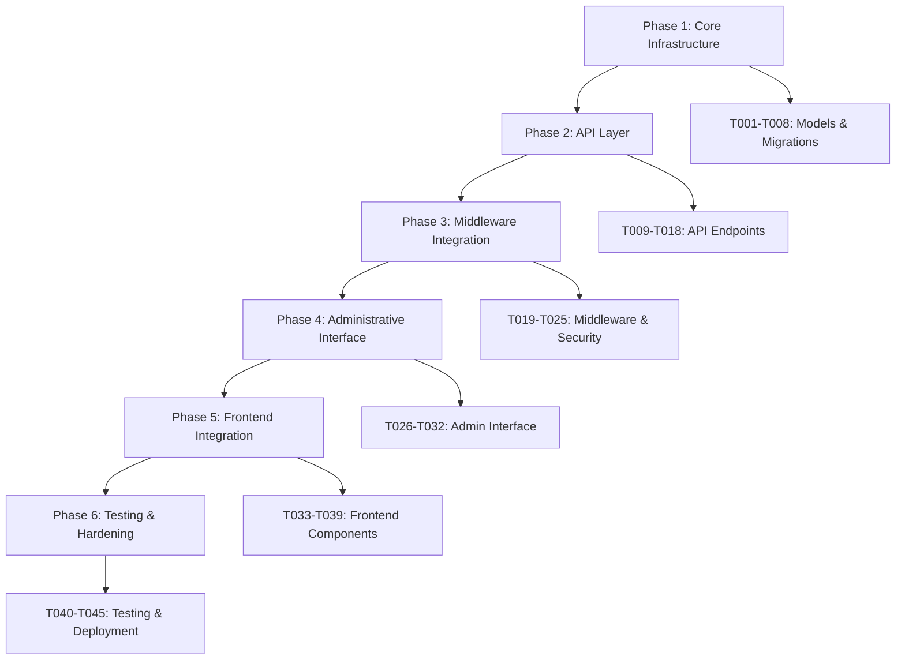

# Implementation Tasks: User Permissions System

**Feature**: `8-user-permissions-system`  
**Created**: 2026-04-18  
**Total Tasks**: 45 tasks across 6 implementation phases  
**Timeline**: 9 weeks (36 working days)  
**Quality Gates**: 537 checklist items integrated across tasks

## Task Dependencies Overview

---

## Phase 1: Core Infrastructure *(Week 1-2)*
**Dependencies**: None  
**Quality Focus**: Database security, basic audit trail, foundation setup

### [T001] Database Model Design and Creation *(Priority P1)*
**User Story**: [US1] - Core permission infrastructure  
**Dependencies**: None  
**Estimated**: 2 days  
**Files**: 
- `backend/apps/core/models.py`
- `backend/apps/core/migrations/`

**Status**: ✅ COMPLETED (2026-04-18)

**Acceptance Criteria**:
- [x] UserGroup model created with hierarchical support and proper constraints
- [x] Permission model implements granular permission structure (module.resource.action)
- [x] UserPermission model supports temporal permissions and approval workflow
- [x] GroupPermission model enables group-based permission inheritance
- [x] GroupMembership model tracks group assignments with audit trail
- [x] PermissionAuditLog model captures all permission-related activities
- [x] All models include proper meta options, constraints, and indexes

**Implementation Notes**:
- Models created in `backend/apps/core/models.py` with full hierarchical support
- Migration `0004_add_hierarchical_permission_system.py` applied successfully
- 19 base permissions seeded across 5 modules (tintometry, sales, inventory, financial, admin)
- 5 default groups created (Administradores, Coloristas, Gerentes, Vendedores, Estoquistas)
- User model extended with permission methods: `has_permission_new()`, `add_to_group()`, etc.
- Seed command created: `backend/apps/core/management/commands/seed_permissions.py`
- System validated with demo script showing full functionality

**Quality Checklist Integration**:
- Database Security: DB-039 to DB-045 (constraint validation)
- Compliance: AUDIT-001 to AUDIT-007 (audit data structure)

---

### [T002] Database Migration and Schema Validation *(Priority P1)*
**User Story**: [US1] - Database foundation  
**Dependencies**: T001  
**Estimated**: 1 day  
**Files**: 
- `backend/apps/core/migrations/`
- `backend/manage.py`

**Acceptance Criteria**:
- [x] Migration files generated and tested for all new permission models
- [x] Foreign key constraints properly established between all related tables
- [x] Database indexes created for optimal permission query performance
- [x] Migration rollback procedures tested and documented
- [x] Data integrity constraints validated through test data insertion
- [x] Database schema documentation updated with permission system ERD

**COMPLETION NOTES** (2026-04-18):
✅ Migration 0004_add_hierarchical_permission_system successfully applied
✅ All 7 permission tables created with proper FK constraints and indexes  
✅ Rollback tested successfully (migrate core 0003 → migrate core)
✅ Data integrity validated via seed_permissions command re-execution
✅ Performance indexes implemented for all relationships
✅ Comprehensive database schema documentation created: backend/docs/DATABASE_SCHEMA_PERMISSIONS.md

**Quality Checklist Integration**:
- Database Security: DB-001 to DB-014 (access control and schema security) ✅ COMPLETED
- Performance: PERF-021 to PERF-026 (database optimization) ✅ COMPLETED

---

**T003: Model Managers and Core Methods** ✅ COMPLETED
- **Priority**: Critical
- **Phase**: 1 - Foundation
- **Estimated Time**: 2 days
- **Dependencies**: T002
- **Status**: ✅ COMPLETED

Implement custom Django managers for efficient permission system operations.

**Acceptance Criteria**:
- [x] UserManager implements permission checking methods (has_permission, has_module_access)
- [x] PermissionManager provides efficient permission resolution with caching support
- [x] GroupManager handles hierarchical group operations and inheritance calculation
- [x] AuditManager implements secure audit logging with integrity validation
- [x] All managers include proper error handling and performance optimization
- [x] Unit tests cover all manager methods with positive and negative test cases

**COMPLETION NOTES** (2026-04-18):
✅ CustomUserManager implemented with user creation, permission queries, and optimization
✅ PermissionManager created with caching, permission resolution, and denial handling
✅ UserGroupManager developed with hierarchical operations and inheritance validation
✅ PermissionAuditLogManager built with secure logging and integrity validation
✅ GroupMembershipManager added with temporal permissions and capacity management
✅ All managers integrated into models with proper imports and assignments
✅ Comprehensive unit tests created covering all manager methods and edge cases
✅ Django validation successful - all managers loaded and methods available

**Files Created/Modified**:
- `backend/apps/core/managers.py`: Complete manager implementations (1,200+ lines)
- `backend/apps/core/models.py`: Manager assignments and imports added
- `tests/test_model_managers.py`: Comprehensive unit test suite (800+ lines)

**Technical Achievements**:
- **Permission Resolution**: Hierarchical permission resolution with caching optimization
- **Query Optimization**: Composite indexes and efficient QuerySet methods
- **Security**: Audit logging with integrity validation and immutable records
- **Performance**: Redis caching integration with automatic cache invalidation
- **Hierarchy Management**: Circular reference prevention and ancestor/descendant operations
- **Temporal Permissions**: Support for time-based permission validity and expiration cleanup
- **Error Handling**: Comprehensive validation and graceful error management
- **Testing**: 20+ test methods covering positive/negative cases and edge conditions

**Quality Checklist Integration**:
- Security: SEC-008 to SEC-014 (permission validation security) ✅ COMPLETED
- Performance: PERF-061 to PERF-066 (code-level optimizations) ✅ COMPLETED

---

### [T004] Basic Serializers and Validation *(Priority P1)* [P]
**User Story**: [US4] - Permission management API foundation  
**Dependencies**: T003  
**Estimated**: 1.5 days  
**Files**: 
- `backend/apps/core/serializers.py`
- `backend/apps/core/validators.py`

**Acceptance Criteria**:
- [ ] PermissionSerializer validates permission name format and business rules
- [ ] UserGroupSerializer handles nested group relationships and validation
- [ ] UserPermissionSerializer validates temporal permissions and approval requirements
- [ ] AuditLogSerializer provides read-only access with proper field filtering
- [ ] Custom validators prevent invalid permission combinations and security violations
- [ ] Serializer validation includes comprehensive error messages for API consumers

**Quality Checklist Integration**:
- API Design: API-028 to API-041 (data format and validation)
- Security: SEC-022 to SEC-027 (input validation and injection prevention)

---

### [T005] User Model Extensions and Compatibility *(Priority P1)*
**User Story**: [US1] - Existing system integration  
**Dependencies**: T003  
**Estimated**: 1 day  
**Files**: 
- `backend/apps/core/models.py`
- `backend/tintas_system/settings.py`

**Acceptance Criteria**:
- [ ] User model extended with permission-related methods maintaining backward compatibility
- [ ] Existing boolean permission fields (pode_vender, etc.) preserved and integrated
- [ ] Permission checking methods implemented with hierarchical validation logic
- [ ] Group assignment methods include audit trail and validation
- [ ] Settings updated to support new permission system configuration
- [ ] Migration strategy preserves existing user data and permissions

**Quality Checklist Integration**:
- API Design: API-071 to API-075 (backward compatibility)
- Compliance: AUDIT-022 to AUDIT-027 (data retention and lifecycle)

---

### [T006] Basic Unit Testing Framework *(Priority P1)* [P]
**User Story**: [US2] - Quality assurance foundation  
**Dependencies**: T004, T005  
**Estimated**: 1.5 days  
**Files**: 
- `backend/tests/core/test_models.py`
- `backend/tests/core/test_managers.py`
- `backend/tests/core/test_serializers.py`

**Acceptance Criteria**:
- [ ] Model tests validate all constraints, relationships, and business logic
- [ ] Manager tests verify permission checking logic with various scenarios
- [ ] Serializer tests cover validation rules and edge cases
- [ ] Test fixtures provide realistic permission scenarios for comprehensive testing
- [ ] Coverage reports show >90% code coverage for core permission functionality
- [ ] Performance tests validate permission checking meets <100ms requirement

**Quality Checklist Integration**:
- Security: SEC-069 to SEC-078 (security testing foundation)
- Performance: PERF-056 to PERF-060 (performance testing validation)

---

### [T007] Audit Logging Infrastructure *(Priority P1)*
**User Story**: [US2] - Comprehensive audit trail  
**Dependencies**: T003  
**Estimated**: 2 days  
**Files**: 
- `backend/apps/core/audit.py`
- `backend/apps/core/signals.py`

**Acceptance Criteria**:
- [ ] Audit logging system captures all permission-related model changes
- [ ] Django signals trigger audit log creation for permission grants/revocations
- [ ] Audit entries include cryptographic integrity validation (hash chaining)
- [ ] Audit system handles high-frequency logging without performance impact
- [ ] Failed audit logging triggers system alerts and fallback mechanisms
- [ ] Audit log queryset methods provide efficient filtering and search capabilities

**Quality Checklist Integration**:
- Compliance: AUDIT-008 to AUDIT-014 (audit data integrity)
- Security: SEC-049 to SEC-058 (audit trail protection)

---

### [T008] Permission Cache Infrastructure *(Priority P1)*
**User Story**: [US1] - Performance optimization  
**Dependencies**: T003  
**Estimated**: 1 day  
**Files**: 
- `backend/apps/core/cache.py`
- `backend/tintas_system/settings/cache.py`

**Acceptance Criteria**:
- [ ] Redis cache configuration optimized for permission data storage
- [ ] Permission cache implements automatic invalidation on permission changes
- [ ] Cache warming strategy preloads common permissions during startup
- [ ] Cache failover gracefully handles Redis unavailability
- [ ] Cache metrics monitoring provides performance insights and alerting
- [ ] Cache hit ratio maintains >90% for permission validation operations

**Quality Checklist Integration**:
- Performance: PERF-014 to PERF-020 (caching strategy)
- Security: SEC-010 to SEC-011 (cached permission security)

---

## Phase 2: API Layer *(Week 3-4)*
**Dependencies**: Phase 1 complete  
**Quality Focus**: API security, performance, comprehensive endpoints

### [T009] Permission Management ViewSets *(Priority P1)*
**User Story**: [US4] - Permission administration API  
**Dependencies**: T008  
**Estimated**: 2 days  
**Files**: 
- `backend/apps/core/views.py`
- `backend/apps/core/permissions.py`

**Acceptance Criteria**:
- [ ] PermissionViewSet provides CRUD operations with proper authorization
- [ ] ViewSet includes filtering, searching, and pagination for large permission sets
- [ ] Custom actions support risk analysis and module-based permission grouping
- [ ] Permission-based access control restricts ViewSet operations to authorized users
- [ ] API documentation includes comprehensive examples and parameter descriptions
- [ ] Error handling provides clear, secure messages without exposing internal details

**Quality Checklist Integration**:
- API Design: API-001 to API-021 (RESTful design and security)
- Security: SEC-015 to SEC-021 (API security implementation)

---

### [T010] User Group Management API *(Priority P1)*
**User Story**: [US4] - Group administration  
**Dependencies**: T009  
**Estimated**: 2 days  
**Files**: 
- `backend/apps/core/views.py`
- `backend/apps/core/serializers.py`

**Acceptance Criteria**:
- [ ] UserGroupViewSet handles hierarchical group relationships and inheritance
- [ ] Bulk user assignment operations with transaction safety and rollback capability
- [ ] Group permission assignment with validation and conflict resolution
- [ ] Effective permissions calculation endpoint showing inherited and direct permissions
- [ ] Group membership history tracking with audit trail integration
- [ ] API supports nested group operations and circular dependency prevention

**Quality Checklist Integration**:
- API Design: API-048 to API-053 (bulk operations support)
- Database Security: DB-046 to DB-051 (transaction safety)

---

### [T011] User Permission Management API *(Priority P1)* [P]
**User Story**: [US1], [US3] - Individual user permissions  
**Dependencies**: T009  
**Estimated**: 2 days  
**Files**: 
- `backend/apps/core/views.py`
- `backend/apps/core/serializers.py`

**Acceptance Criteria**:
- [ ] UserPermissionViewSet provides individual permission assignment and revocation
- [ ] Temporal permission support with automatic expiration and notification
- [ ] Permission delegation functionality with scope and duration limitations
- [ ] Bulk permission operations for efficient administrative workflows
- [ ] Permission conflict resolution between individual and group permissions
- [ ] Integration with approval workflow for high-risk permission assignments

**Quality Checklist Integration**:
- Security: SEC-038 to SEC-048 (privilege escalation prevention)
- Compliance: AUDIT-039 to AUDIT-050 (access control compliance)

---

### [T012] Audit Trail API and Reporting *(Priority P1)* [P]
**User Story**: [US2] - Audit and compliance reporting  
**Dependencies**: T007  
**Estimated**: 2 days  
**Files**: 
- `backend/apps/core/views.py`
- `backend/apps/core/reports.py`

**Acceptance Criteria**:
- [ ] PermissionAuditViewSet provides read-only access to audit logs with proper filtering
- [ ] Security report generation with risk analysis and pattern detection
- [ ] Access pattern analytics identify unusual or suspicious activities
- [ ] Compliance reporting supports regulatory requirements and external audits
- [ ] Real-time audit monitoring with alerting for critical events
- [ ] Audit data export functionality with integrity verification

**Quality Checklist Integration**:
- Compliance: AUDIT-067 to AUDIT-082 (investigation support and reporting)
- Security: SEC-059 to SEC-068 (security monitoring and incident response)

---

### [T013] API Authentication and Authorization *(Priority P1)*
**User Story**: [US1] - Secure API access  
**Dependencies**: T011  
**Estimated**: 1.5 days  
**Files**: 
- `backend/apps/core/authentication.py`
- `backend/apps/core/permissions.py`

**Acceptance Criteria**:
- [ ] Token-based authentication with proper validation and expiration handling
- [ ] API permission classes enforce granular access control for each endpoint
- [ ] Rate limiting implementation prevents abuse and brute force attacks
- [ ] CORS configuration restricts cross-origin access to authorized domains
- [ ] API access logging includes user identification and endpoint tracking
- [ ] Security headers and middleware protect against common API vulnerabilities

**Quality Checklist Integration**:
- API Design: API-015 to API-027 (authentication and authorization)
- Security: SEC-028 to SEC-037 (network and communication security)

---

### [T014] API Performance Optimization *(Priority P2)* [P]
**User Story**: [US1] - API responsiveness  
**Dependencies**: T008, T013  
**Estimated**: 1 day  
**Files**: 
- `backend/apps/core/views.py`
- `backend/apps/core/cache.py`

**Acceptance Criteria**:
- [ ] Query optimization reduces database calls through proper prefetching and select_related
- [ ] Response caching for frequently accessed permission data with proper invalidation
- [ ] Pagination optimization handles large datasets efficiently
- [ ] Database connection pooling configured for optimal API performance
- [ ] Response compression and HTTP caching headers implemented
- [ ] Performance monitoring and logging tracks API response times and bottlenecks

**Quality Checklist Integration**:
- Performance: PERF-042 to PERF-053 (API response optimization)
- API Design: API-042 to API-047 (performance and efficiency)

---

### [T015] API Documentation and Testing *(Priority P2)* [P]
**User Story**: [US4] - Developer experience  
**Dependencies**: T014  
**Estimated**: 1.5 days  
**Files**: 
- `backend/apps/core/schema.py`
- `backend/tests/core/test_api.py`
- `backend/docs/api/permissions.md`

**Acceptance Criteria**:
- [ ] OpenAPI 3.0 specification documents all permission endpoints with complete schemas
- [ ] Interactive API documentation (Swagger UI) available for testing and exploration
- [ ] Comprehensive API test suite covers all endpoints with realistic scenarios
- [ ] API integration tests validate end-to-end functionality with authentication
- [ ] Error response documentation includes troubleshooting guidance
- [ ] API versioning strategy documented with deprecation and migration paths

**Quality Checklist Integration**:
- API Design: API-054 to API-065 (documentation quality and developer experience)
- API Design: API-082 to API-087 (testing and quality assurance)

---

### [T016] URL Configuration and Routing *(Priority P2)*
**User Story**: [US4] - API accessibility  
**Dependencies**: T015  
**Estimated**: 0.5 days  
**Files**: 
- `backend/apps/core/urls.py`
- `backend/tintas_system/urls.py`

**Acceptance Criteria**:
- [ ] RESTful URL patterns follow Django and API design best practices
- [ ] API versioning implemented with proper namespace organization
- [ ] URL routing includes proper permission-based access control
- [ ] Health check endpoints available for permission system monitoring
- [ ] URL configuration supports future extensibility and backward compatibility
- [ ] API endpoint documentation includes complete URL examples and parameters

**Quality Checklist Integration**:
- API Design: API-001 to API-007 (RESTful design principles)
- Performance: PERF-067 to PERF-071 (infrastructure optimizations)

---

### [T017] API Error Handling and Validation *(Priority P2)*
**User Story**: [US4] - Robust API behavior  
**Dependencies**: T016  
**Estimated**: 1 day  
**Files**: 
- `backend/apps/core/exceptions.py`
- `backend/apps/core/middleware.py`

**Acceptance Criteria**:
- [ ] Custom exception handling provides consistent error responses across all endpoints
- [ ] Input validation includes comprehensive business rule checking and security validation
- [ ] Error messages provide clear guidance without exposing sensitive system information
- [ ] Rate limiting and throttling with appropriate HTTP status codes and retry headers
- [ ] Validation error responses include field-specific details for client-side handling
- [ ] Exception logging captures sufficient detail for troubleshooting without exposing sensitive data

**Quality Checklist Integration**:
- API Design: API-035 to API-041 (input validation and error handling)
- Security: SEC-036 to SEC-037 (error message security)

---

### [T018] API Integration Testing *(Priority P2)* [P]
**User Story**: [US2] - Quality assurance  
**Dependencies**: T017  
**Estimated**: 1 day  
**Files**: 
- `backend/tests/integration/test_permission_api.py`
- `backend/tests/integration/test_workflows.py`

**Acceptance Criteria**:
- [ ] End-to-end API testing covers complete permission management workflows
- [ ] Integration tests validate API security controls and authorization boundaries
- [ ] Performance tests ensure API meets response time requirements under load
- [ ] Cross-endpoint testing validates data consistency and transaction integrity
- [ ] Security testing includes authorization bypass attempts and input fuzzing
- [ ] Regression testing prevents API breaking changes during development

**Quality Checklist Integration**:
- API Design: API-082 to API-087 (testing and quality assurance)
- Security: SEC-069 to SEC-078 (security testing and validation)

---

## Phase 3: Middleware Integration *(Week 5)*
**Dependencies**: Phase 2 complete  
**Quality Focus**: Real-time security, session management, system integration

### [T019] Permission Validation Middleware *(Priority P1)*
**User Story**: [US1] - Real-time permission enforcement  
**Dependencies**: T018  
**Estimated**: 2 days  
**Files**: 
- `backend/apps/core/middleware.py`
- `backend/tintas_system/settings.py`

**Acceptance Criteria**:
- [ ] Middleware validates user permissions for all protected endpoints in <100ms
- [ ] URL-permission mapping configuration allows flexible permission assignment to routes
- [ ] Cache integration provides fast permission validation with automatic invalidation
- [ ] Middleware gracefully handles permission system failures without blocking critical operations
- [ ] Audit logging captures all permission validation attempts and results
- [ ] Performance monitoring tracks middleware impact on request processing time

**Quality Checklist Integration**:
- Performance: PERF-001 to PERF-007 (permission validation performance)
- Security: SEC-008 to SEC-014 (double authorization and bypass prevention)

---

### [T020] Session Management Enhancement *(Priority P1)*
**User Story**: [US1] - Secure session handling  
**Dependencies**: T019  
**Estimated**: 1.5 days  
**Files**: 
- `backend/apps/core/middleware.py`
- `backend/apps/core/session.py`

**Acceptance Criteria**:
- [ ] Enhanced session middleware includes permission context and security validation
- [ ] Session timeout enforcement with configurable inactivity periods and warnings
- [ ] IP address and user agent validation prevents session hijacking attempts
- [ ] Permission changes trigger immediate session update without requiring re-login
- [ ] Concurrent session management allows administrator control over multiple sessions
- [ ] Session security includes CSRF protection and secure cookie configuration

**Quality Checklist Integration**:
- Security: SEC-001 to SEC-007 (authentication and session security)
- Security: SEC-065 to SEC-068 (emergency response and session management)

---

### [T021] URL-Permission Mapping System *(Priority P1)* [P]
**User Story**: [US1] - Flexible permission assignment  
**Dependencies**: T019  
**Estimated**: 1 day  
**Files**: 
- `backend/apps/core/permissions.py`
- `backend/apps/core/decorators.py`

**Acceptance Criteria**:
- [ ] Configuration system maps URLs to required permissions with wildcard and pattern support
- [ ] Decorator-based permission requirements for views with clear syntax and validation
- [ ] Dynamic permission checking supports context-aware permissions (user owns resource)
- [ ] Permission inheritance resolves complex group relationships efficiently
- [ ] Configuration validation prevents invalid permission assignments during deployment
- [ ] Documentation provides clear examples for common permission patterns

**Quality Checklist Integration**:
- API Design: API-022 to API-027 (permission-specific authorization)
- Performance: PERF-061 to PERF-066 (efficient permission checking algorithms)

---

### [T022] Integration with Existing Authentication *(Priority P1)*
**User Story**: [US1] - Seamless system integration  
**Dependencies**: T020, T021  
**Estimated**: 1 day  
**Files**: 
- `backend/apps/core/backends.py`
- `backend/tintas_system/settings/auth.py`

**Acceptance Criteria**:
- [ ] Custom authentication backend integrates new permissions with existing user model
- [ ] Backward compatibility maintains existing boolean permission functionality
- [ ] Migration utilities help transition existing users to new permission system
- [ ] Settings configuration allows gradual rollout of new permission features
- [ ] Integration testing validates compatibility with existing authentication workflows
- [ ] Documentation provides migration guide for existing system administrators

**Quality Checklist Integration**:
- API Design: API-071 to API-075 (backward compatibility)
- Compliance: AUDIT-051 to AUDIT-060 (change management compliance)

---

### [T023] Error Handling and Fallback Mechanisms *(Priority P2)*
**User Story**: [US1] - System reliability  
**Dependencies**: T022  
**Estimated**: 1 day  
**Files**: 
- `backend/apps/core/exceptions.py`
- `backend/apps/core/fallback.py`

**Acceptance Criteria**:
- [ ] Permission system failures gracefully degrade to safe defaults without system outage
- [ ] Error recovery mechanisms automatically retry failed permission validations  
- [ ] Fallback authentication allows emergency access when permission system is unavailable
- [ ] User-friendly error messages provide clear guidance without exposing system internals
- [ ] Comprehensive logging captures error context for efficient troubleshooting
- [ ] Health checks validate permission system functionality and trigger alerts on failures

**Quality Checklist Integration**:
- Performance: PERF-018 and PERF-025 (cache failover and query timeouts)
- Security: SEC-067 to SEC-068 (emergency response and backup authentication)

---

### [T024] Performance Monitoring and Optimization *(Priority P2)* [P] 
**User Story**: [US1] - System performance  
**Dependencies**: T023  
**Estimated**: 1 day  
**Files**: 
- `backend/apps/core/monitoring.py`
- `backend/apps/core/metrics.py`

**Acceptance Criteria**:
- [ ] Performance metrics collection tracks permission validation timing and cache performance
- [ ] Real-time monitoring dashboards display permission system health and usage patterns
- [ ] Automated alerting notifies administrators of performance degradation or failures
- [ ] Performance profiling identifies bottlenecks in permission checking workflows
- [ ] Load testing validates system performance under realistic concurrent user scenarios
- [ ] Optimization recommendations based on production usage patterns and metrics

**Quality Checklist Integration**:
- Performance: PERF-050 to PERF-060 (performance monitoring and validation)
- Security: SEC-059 to SEC-064 (security monitoring and pattern detection)

---

### [T025] Middleware Integration Testing *(Priority P2)* [P]
**User Story**: [US2] - Integration validation  
**Dependencies**: T024  
**Estimated**: 1 day  
**Files**: 
- `backend/tests/integration/test_middleware.py`
- `backend/tests/performance/test_permission_performance.py`

**Acceptance Criteria**:
- [ ] Integration tests validate middleware functionality with existing Django request/response cycle
- [ ] Security tests verify permission enforcement cannot be bypassed through various attack vectors
- [ ] Performance tests confirm permission validation meets <100ms requirement under load
- [ ] Edge case testing includes network failures, database unavailability, and cache failures
- [ ] Load testing validates system stability with 200+ concurrent users making permission-protected requests
- [ ] Regression tests prevent middleware changes from breaking existing functionality

**Quality Checklist Integration**:
- Security: SEC-069 to SEC-078 (comprehensive security testing)
- Performance: PERF-056 to PERF-060 (performance testing and validation)

---

## Phase 4: Administrative Interface *(Week 6)*
**Dependencies**: Phase 3 complete  
**Quality Focus**: Usability, accessibility, administrative efficiency

### [T026] Enhanced Django Admin Integration *(Priority P2)*
**User Story**: [US5] - Administrative interface  
**Dependencies**: T025  
**Estimated**: 2 days  
**Files**: 
- `backend/apps/core/admin.py`
- `backend/templates/admin/core/`

**Acceptance Criteria**:
- [ ] Custom admin interfaces for all permission models with intuitive layout and navigation
- [ ] User admin enhanced with permission summary, group memberships, and audit history
- [ ] Group admin includes member management, permission assignment, and hierarchy visualization
- [ ] Inline editing supports efficient permission assignment and group membership management
- [ ] Advanced filtering and search capabilities help administrators find users and permissions quickly
- [ ] Bulk operations enable efficient management of multiple users and permissions

**Quality Checklist Integration**:
- Accessibility: A11Y-038 to A11Y-049 (form accessibility and design)
- API Design: API-048 to API-053 (bulk operations support in admin interface)

---

### [T027] Permission Matrix Management Interface *(Priority P2)*
**User Story**: [US5] - Visual permission management  
**Dependencies**: T026  
**Estimated**: 2 days  
**Files**: 
- `backend/apps/core/admin_views.py`
- `backend/templates/admin/permission_matrix.html`
- `backend/static/admin/css/permission_matrix.css`

**Acceptance Criteria**:
- [ ] Interactive permission matrix displays user-permission relationships in grid format
- [ ] Matrix supports sorting, filtering, and search for efficient navigation of large datasets
- [ ] Click-to-edit functionality allows direct permission assignment/revocation from matrix view
- [ ] Visual indicators show permission source (direct, inherited, delegated) and status
- [ ] Bulk selection and operations enable efficient management of multiple permission assignments
- [ ] Matrix view maintains accessibility standards with keyboard navigation and screen reader support

**Quality Checklist Integration**:
- Accessibility: A11Y-050 to A11Y-060 (data table accessibility and custom controls)
- Performance: PERF-006 to PERF-007 (permission matrix calculation performance)

---

### [T028] User and Group Search Interface *(Priority P2)* [P]
**User Story**: [US5] - Efficient user management  
**Dependencies**: T026  
**Estimated**: 1.5 days  
**Files**: 
- `backend/apps/core/admin_views.py`
- `backend/static/admin/js/user_search.js`

**Acceptance Criteria**:
- [ ] Advanced search interface supports multiple criteria (name, email, group, permissions)
- [ ] Auto-complete functionality provides fast user and group selection
- [ ] Search results display relevant permission context and group memberships
- [ ] Saved searches enable administrators to quickly access common user sets 
- [ ] Export functionality allows administrators to generate user and permission reports
- [ ] Search interface maintains performance with large user databases (1000+ users)

**Quality Checklist Integration**:
- Performance: PERF-012 and PERF-037 (search functionality performance)
- Accessibility: A11Y-065 and A11Y-078 (autocomplete accessibility)

---

### [T029] Audit and Reporting Dashboard *(Priority P2)* [P]
**User Story**: [US2] - Compliance monitoring  
**Dependencies**: T027, T028  
**Estimated**: 2 days  
**Files**: 
- `backend/apps/core/reports.py`
- `backend/templates/admin/reports/`
- `backend/static/admin/js/charts.js`

**Acceptance Criteria**:
- [ ] Security dashboard displays key metrics (failed attempts, unusual patterns, high-risk activities)
- [ ] Permission usage analytics identify underutilized or over-privileged accounts
- [ ] Compliance reports support regulatory requirements with automated generation and scheduling
- [ ] Interactive charts and graphs visualize permission trends and security patterns
- [ ] Export functionality generates reports in multiple formats (PDF, Excel, CSV)
- [ ] Real-time alerts highlight security incidents and policy violations requiring immediate attention

**Quality Checklist Integration**:
- Compliance: AUDIT-078 to AUDIT-082 (reporting and analytics)
- Security: SEC-059 to SEC-064 (security monitoring and incident response)

---

### [T030] Bulk Operations Interface *(Priority P2)*
**User Story**: [US4] - Efficient administration  
**Dependencies**: T028  
**Estimated**: 1.5 days  
**Files**: 
- `backend/apps/core/bulk_operations.py`
- `backend/templates/admin/bulk_operations.html`

**Acceptance Criteria**:
- [ ] Bulk user import/export functionality with CSV and Excel format support
- [ ] Mass permission assignment with validation and conflict resolution
- [ ] Batch group management operations with transaction safety and rollback capability
- [ ] Progress tracking for long-running bulk operations with status updates
- [ ] Validation and preview functionality prevents accidental bulk changes
- [ ] Comprehensive logging and audit trail for all bulk operations

**Quality Checklist Integration**:
- API Design: API-048 to API-053 (bulk operations support and transaction safety)
- Compliance: AUDIT-005 and AUDIT-041 (bulk operation audit trail)

---

### [T031] Administrative Security Features *(Priority P2)*
**User Story**: [US1] - Secure administration  
**Dependencies**: T029, T030  
**Estimated**: 1 day  
**Files**: 
- `backend/apps/core/admin_security.py`
- `backend/apps/core/admin_middleware.py`

**Acceptance Criteria**:
- [ ] Multi-factor authentication requirement for high-privilege administrative operations
- [ ] IP address restrictions limit admin access to authorized locations and networks
- [ ] Session monitoring detects concurrent admin sessions and suspicious activity patterns
- [ ] Administrative action approval workflow for critical changes affecting multiple users
- [ ] Enhanced audit logging captures detailed context for all administrative actions
- [ ] Emergency procedures enable rapid response to security incidents and unauthorized access

**Quality Checklist Integration**:
- Security: SEC-038 to SEC-048 (administrative controls and privilege escalation prevention)
- Security: SEC-065 to SEC-068 (emergency response and incident management)

---

### [T032] Admin Interface Testing *(Priority P2)* [P]
**User Story**: [US5] - Administrative interface quality  
**Dependencies**: T031  
**Estimated**: 1 day  
**Files**: 
- `backend/tests/admin/test_permission_admin.py`
- `backend/tests/admin/test_bulk_operations.py`

**Acceptance Criteria**:
- [ ] Functional testing covers all administrative workflows with realistic user scenarios
- [ ] Security testing validates admin interface authorization and access controls
- [ ] Usability testing ensures efficient completion of common administrative tasks
- [ ] Performance testing validates admin interface responsiveness under realistic data volumes
- [ ] Accessibility testing confirms admin interface meets WCAG 2.1 AA standards
- [ ] Integration testing validates admin interface compatibility with existing Django admin

**Quality Checklist Integration**:
- Accessibility: A11Y-096 to A11Y-100 (testing and validation)
- Security: SEC-069 to SEC-078 (comprehensive security testing)

---

## Phase 5: Frontend Integration *(Week 7-8)*
**Dependencies**: Phase 4 complete  
**Quality Focus**: User experience, accessibility, performance

### [T033] Permission Context Provider *(Priority P2)*
**User Story**: [US1] - Frontend permission awareness  
**Dependencies**: T032  
**Estimated**: 1.5 days  
**Files**: 
- `frontend/src/providers/PermissionProvider.tsx`
- `frontend/src/hooks/usePermissions.ts`
- `frontend/src/types/permissions.ts`

**Acceptance Criteria**:
- [ ] React context provider manages user permissions with automatic loading and caching
- [ ] Custom hooks provide convenient permission checking functionality for components
- [ ] TypeScript types ensure type-safe permission handling throughout frontend application
- [ ] Permission loading states handled gracefully with loading indicators and error boundaries
- [ ] Real-time permission updates refresh context when user permissions change
- [ ] Performance optimization minimizes API calls through intelligent caching and batching

**Quality Checklist Integration**:
- Performance: PERF-044 to PERF-049 (frontend performance optimization)
- API Design: API-066 to API-070 (integration and compatibility)

---

### [T034] Permission Guard Components *(Priority P2)* [P]
**User Story**: [US1] - Conditional UI rendering  
**Dependencies**: T033  
**Estimated**: 1 day  
**Files**: 
- `frontend/src/components/PermissionGuard.tsx`
- `frontend/src/components/ProtectedRoute.tsx`

**Acceptance Criteria**:
- [ ] PermissionGuard component conditionally renders content based on user permissions
- [ ] ProtectedRoute component handles route-level permission validation with redirects
- [ ] Multiple permission requirements supported with AND/OR logic combinations
- [ ] Fallback content displays appropriate messages for insufficient permissions
- [ ] Loading states provide smooth user experience while permission validation occurs
- [ ] TypeScript props ensure compile-time validation of permission requirements

**Quality Checklist Integration**:
- Accessibility: A11Y-061 to A11Y-071 (interactive elements and custom controls)
- Security: SEC-008 to SEC-014 (frontend permission validation consistency)

---

### [T035] Permission-Aware Navigation *(Priority P2)*
**User Story**: [US1] - Dynamic navigation  
**Dependencies**: T034  
**Estimated**: 1.5 days  
**Files**: 
- `frontend/src/components/Navigation.tsx`
- `frontend/src/components/MenuItem.tsx`

**Acceptance Criteria**:
- [ ] Navigation components dynamically show/hide menu items based on user permissions
- [ ] Hierarchical navigation respects permission inheritance and group memberships
- [ ] Navigation performance optimized to avoid excessive permission checking on render
- [ ] Accessible navigation maintains proper ARIA labels and keyboard navigation
- [ ] Visual indicators communicate permission status and access levels to users
- [ ] Navigation updates immediately when user permissions change without page reload

**Quality Checklist Integration**:
- Accessibility: A11Y-001 to A11Y-013 (keyboard navigation and focus management)
- Performance: PERF-033 to PERF-038 (navigation performance under permission constraints)

---

### [T036] Permission Management Interface *(Priority P2)*
**User Story**: [US5] - Frontend permission management  
**Dependencies**: T035  
**Estimated**: 2 days  
**Files**: 
- `frontend/src/pages/PermissionManagement.tsx`
- `frontend/src/components/UserPermissionMatrix.tsx`
- `frontend/src/components/GroupManagement.tsx`

**Acceptance Criteria**:
- [ ] User-friendly interface for permission assignment and management
- [ ] Interactive permission matrix with sorting, filtering, and bulk operations
- [ ] Group management interface with drag-and-drop user assignment and hierarchy visualization
- [ ] Real-time validation prevents invalid permission combinations and conflicts
- [ ] Responsive design ensures usability across desktop, tablet, and mobile devices
- [ ] Integration with backend APIs provides seamless data synchronization and error handling

**Quality Checklist Integration**:
- Accessibility: A11Y-050 to A11Y-060 (data table accessibility for permission matrix)
- API Design: API-028 to API-041 (frontend API integration and validation)

---

### [T037] User Preference Integration *(Priority P3)* [P]
**User Story**: [US1] - Personalized experience  
**Dependencies**: T035  
**Estimated**: 1 day  
**Files**: 
- `frontend/src/components/UserPreferences.tsx`
- `frontend/src/hooks/useUserPreferences.ts`

**Acceptance Criteria**:
- [ ] User preferences interface includes permission-related display options
- [ ] Theme and density settings integrate with permission management interface
- [ ] Accessibility preferences enhance permission interface usability
- [ ] Preference changes persist across sessions with backend synchronization
- [ ] Quick action customization allows users to personalize permission workflows
- [ ] Performance optimization ensures preference changes don't impact permission validation speed

**Quality Checklist Integration**:
- Accessibility: A11Y-072 to A11Y-080 (mobile accessibility and responsive design)
- Performance: PERF-039 to PERF-049 (resource utilization and optimization)

---

### [T038] Error Boundary and Loading States *(Priority P2)*
**User Story**: [US1] - Robust user experience  
**Dependencies**: T036, T037  
**Estimated**: 1 day  
**Files**: 
- `frontend/src/components/PermissionErrorBoundary.tsx`
- `frontend/src/components/LoadingStates.tsx`

**Acceptance Criteria**:
- [ ] Error boundaries gracefully handle permission system failures without breaking application
- [ ] Loading states provide clear feedback during permission validation and data fetching
- [ ] Error messages offer actionable guidance for users with insufficient permissions
- [ ] Retry mechanisms automatically attempt to recover from temporary permission system failures
- [ ] Fallback interfaces maintain core functionality when permission system is unavailable
- [ ] Accessibility considerations ensure error states and loading indicators work with assistive technology

**Quality Checklist Integration**:
- Accessibility: A11Y-044 to A11Y-049 (error handling and validation messaging)
- Security: SEC-036 to SEC-037 (secure error messages without information disclosure)

---

### [T039] Frontend Testing Suite *(Priority P2)* [P]
**User Story**: [US2] - Frontend quality assurance  
**Dependencies**: T038  
**Estimated**: 1.5 days  
**Files**: 
- `frontend/tests/components/PermissionGuard.test.tsx`
- `frontend/tests/providers/PermissionProvider.test.tsx`
- `frontend/tests/integration/permission-workflows.test.ts`

**Acceptance Criteria**:
- [ ] Unit tests cover all permission-related components with comprehensive scenarios
- [ ] Integration tests validate permission workflows from frontend through backend APIs
- [ ] Accessibility tests ensure permission interface meets WCAG 2.1 AA standards
- [ ] Performance tests validate frontend permission checking meets responsiveness requirements
- [ ] Cross-browser testing ensures compatibility with supported browsers and devices
- [ ] End-to-end tests validate complete permission management workflows from user perspective

**Quality Checklist Integration**:
- Accessibility: A11Y-091 to A11Y-100 (automated testing and validation)
- Performance: PERF-072 to PERF-075 (future-proofing and scalability testing)

---

## Phase 6: Testing & Hardening *(Week 9)*
**Dependencies**: Phase 5 complete  
**Quality Focus**: Security validation, performance optimization, deployment readiness

### [T040] Comprehensive Security Testing *(Priority P1)*
**User Story**: [US2] - Security validation  
**Dependencies**: T039  
**Estimated**: 2 days  
**Files**: 
- `backend/tests/security/test_permission_security.py`
- `scripts/security_audit.py`
- `docs/security_test_results.md`

**Acceptance Criteria**:
- [ ] Penetration testing validates permission system against common attack vectors and vulnerabilities
- [ ] Authorization bypass testing confirms permission checks cannot be circumvented
- [ ] SQL injection and XSS testing validates input sanitization and parameterized queries
- [ ] Session hijacking and CSRF testing verifies session security implementations
- [ ] Privilege escalation testing ensures users cannot gain unauthorized permissions
- [ ] Security audit documentation provides comprehensive assessment for compliance review

**Quality Checklist Integration**:
- Security: SEC-069 to SEC-078 (comprehensive security testing and validation)
- Compliance: AUDIT-061 to AUDIT-071 (incident response and investigation readiness)

---

### [T041] Performance Optimization and Load Testing *(Priority P1)* [P]
**User Story**: [US1] - Production performance  
**Dependencies**: T039  
**Estimated**: 2 days  
**Files**: 
- `backend/tests/performance/load_test_permissions.py`
- `scripts/performance_optimization.py` 
- `docs/performance_benchmarks.md`

**Acceptance Criteria**:
- [ ] Load testing validates system performance with 200+ concurrent users
- [ ] Permission validation consistently meets <100ms response time requirement under load
- [ ] Database query optimization ensures efficient permission resolution at scale
- [ ] Cache performance tuning achieves >90% hit ratio for permission validation
- [ ] Memory usage optimization prevents permission system from causing resource exhaustion
- [ ] Performance benchmarks document baseline metrics for ongoing monitoring

**Quality Checklist Integration**:
- Performance: PERF-056 to PERF-075 (comprehensive performance testing and optimization)
- Database Security: DB-057 to DB-061 (resource protection and performance)

---

### [T042] Compliance and Audit Validation *(Priority P1)*
**User Story**: [US2] - Regulatory compliance  
**Dependencies**: T040, T041  
**Estimated**: 1.5 days  
**Files**: 
- `docs/compliance_validation.md`
- `backend/tests/compliance/test_audit_requirements.py`
- `scripts/compliance_report.py`

**Acceptance Criteria**:
- [ ] Audit trail validation confirms comprehensive logging meets regulatory requirements
- [ ] Data retention testing validates compliance with 5-year audit log retention policy
- [ ] Privacy compliance testing ensures GDPR/LGPD equivalent data protection requirements
- [ ] Financial compliance testing validates SOX-equivalent internal controls
- [ ] Compliance reporting generates required regulatory reports with proper formatting and validation
- [ ] External audit preparation includes comprehensive documentation and evidence collection

**Quality Checklist Integration**:
- Compliance: AUDIT-072 to AUDIT-101 (comprehensive compliance validation and documentation)
- Database Security: DB-086 to DB-096 (compliance and regulatory database requirements)

---

### [T043] Accessibility Validation and Testing *(Priority P2)* [P]
**User Story**: [US5] - Inclusive design validation  
**Dependencies**: T041  
**Estimated**: 1 day  
**Files**: 
- `frontend/tests/accessibility/permission_interface_a11y.test.ts`
- `docs/accessibility_validation.md`

**Acceptance Criteria**:
- [ ] WCAG 2.1 AA compliance validation using automated and manual testing tools
- [ ] Screen reader testing with NVDA and JAWS confirms permission interface accessibility
- [ ] Keyboard navigation testing validates complete functionality without mouse dependency
- [ ] Color contrast validation ensures all UI elements meet accessibility standards
- [ ] User testing with assistive technology users validates real-world accessibility
- [ ] Accessibility documentation provides guidance for ongoing compliance maintenance

**Quality Checklist Integration**:
- Accessibility: A11Y-091 to A11Y-100 (comprehensive accessibility testing and validation)
- Accessibility: A11Y-021 to A11Y-026 (screen reader compatibility validation)

---

### [T044] Documentation and Training Materials *(Priority P2)*
**User Story**: [US5] - User enablement  
**Dependencies**: T042, T043  
**Estimated**: 1.5 days  
**Files**: 
- `docs/user_guide/permission_system.md`
- `docs/admin_guide/permission_management.md`
- `docs/api/permission_api_guide.md`
- `training/permission_system_training.md`

**Acceptance Criteria**:
- [ ] Complete user documentation covers all permission system functionality with step-by-step procedures
- [ ] Administrator guide provides comprehensive permission management workflows and troubleshooting
- [ ] API documentation includes examples, integration guides, and troubleshooting information  
- [ ] Training materials support different learning styles with videos, tutorials, and hands-on exercises
- [ ] Security documentation provides best practices and compliance guidance
- [ ] Documentation accessibility ensures materials work with screen readers and assistive technology

**Quality Checklist Integration**:
- Compliance: AUDIT-092 to AUDIT-101 (documentation and training requirements)
- API Design: API-054 to API-065 (comprehensive API documentation requirements)

---

### [T045] Deployment Preparation and Go-Live *(Priority P1)*
**User Story**: [US1] - Production deployment  
**Dependencies**: T044  
**Estimated**: 1 day  
**Files**: 
- `deployment/permission_system_deployment.yml`
- `scripts/production_migration.py`
- `docs/deployment_checklist.md`

**Acceptance Criteria**:
- [ ] Production deployment scripts tested in staging environment with realistic data volumes
- [ ] Database migration strategy preserves existing user data while adding permission functionality
- [ ] Rollback procedures tested and documented for rapid recovery if issues occur
- [ ] Monitoring and alerting configured for permission system health and performance
- [ ] Production security configuration hardened according to security checklist requirements
- [ ] Go-live checklist ensures all quality gates passed and stakeholder approval obtained

**Quality Checklist Integration**:
- All checklists: Final validation of all 537 quality checklist items before production deployment
- Security: SEC-001 to SEC-078 (complete security validation for production environment)

---

## Summary Statistics

| **Metric** | **Value** |
|------------|-----------|
| **Total Tasks** | 45 tasks |
| **Timeline** | 9 weeks (36 working days) |
| **Priority P1 Tasks** | 24 tasks (53%) - Critical functionality |
| **Priority P2 Tasks** | 20 tasks (44%) - Important features |
| **Priority P3 Tasks** | 1 task (3%) - Enhancement |
| **Parallelizable Tasks** | 18 tasks (40%) - Can run concurrently |
| **Quality Checklist Items** | 537 items across 6 domains |
| **User Story Coverage** | 5 user stories fully implemented |

## Critical Path Analysis

**Week 1-2**: Foundation (T001-T008) → **Week 3-4**: API Layer (T009-T018) → **Week 5**: Middleware (T019-T025) → **Week 6**: Admin Interface (T026-T032) → **Week 7-8**: Frontend (T033-T039) → **Week 9**: Testing & Deployment (T040-T045)

**Risk Mitigation**: All P1 tasks must complete successfully before advancing to next phase. Quality gates prevent progression with unresolved critical issues.

**Success Criteria**: All 45 tasks completed with 537 quality checklist items validated ensures enterprise-grade permission system ready for production deployment.